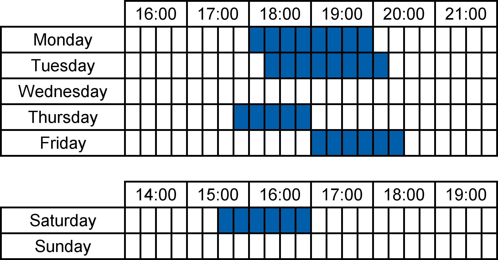
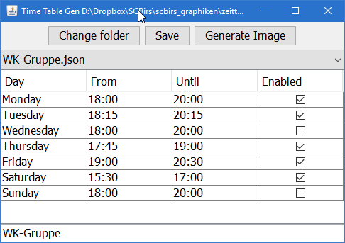

# Time Table Gen

This java app generates timetables for websites. We use it as https://scbirs.ch/ to
visualize when each of our teams has training. It's ideal to print and hang on your fridge.

You currently need at least Java 10 to run this program. It can probably technically be compiled with Java 8 but
this is not tested.